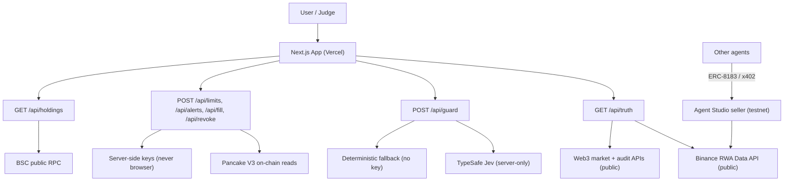
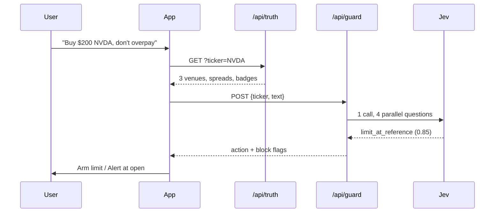
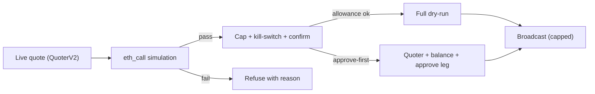

# NightDesk — the session-aware buy screen for tokenized stocks

> Friday 4pm ET: the reference freezes. The token doesn't.
> Every screen shows you a price. None tells you what it means.

**Live:** app (deploy link TBD) · [Agent card](https://bnbagent-api.bnbchain.world/v1/rt/01M34DSYKGTMQ4QQ1EFQE99T1V/.well-known/agent-card.json) (testnet trial) · [Demo wallet](https://bscscan.com/address/0x4Ba1e9e275EF61B56C99532D0066506436201D73) · [Repo](https://github.com/PhiBao/nightdesk)

Built for the **BNB Hack: Tokenized Stocks Edition** (BSC mainnet, spot only).

---

## 1. Thesis

### What
NightDesk is the buy screen tokenized stocks should have shipped with: type a
ticker, see what the after-hours price *means* — session badge, on-chain vs
reference spread, cheapest venue — then act through a guard instead of a blind
swap: limit-at-reference, alert-at-open, or a simulated-then-capped fill.

### Why
Tokenized equities trade 24/7 against a reference that sleeps nights and
weekends. On Labor Day weekend 2026, ~$1B changed hands while the underlying
market was shut — buyers paid stale-quote premiums with no tool telling them
so. Wallets show one number; brokers show another; the gap is invisible, and
the cost is real (we measured +180bps on a Sunday NVDA quote).

Worse, we discovered on-chain that **the pools themselves can't settle**: 28
liquid USDT pools across 10 tickers × Ondo/xStocks/bStocks all price correctly
yet revert on delivery to retail wallets. Everyone building "one-tap buy"
demos is demoing a button that cannot land. NightDesk is the first screen that
says so — with receipts.

### How
- **Truth card** — live RWA feeds (both prices + market status), cheapest venue
  first, session badge, real on-chain volume, token audit. No key needed.
- **Guard** — one batched TypeSafe call (intent, severity, block-flag,
  staleness) routes to limit / alert / guarded market. Code owns math; the
  model supplies judgment. Deterministic fallback keeps the demo alive keyless.
- **Executability probe** — quoter + delivery dry-run per ticker. Priced but
  undeliverable pools are labeled, not hidden.
- **Agent seller** — the same truth feed sold as a service: ERC-8004 identity,
  ERC-8183 escrow, x402 rail; fixed-code pricing, LLM narrates computed numbers.
- **Proof, not claims** — 4 mainnet txs, verifiable balances, public code.

---

## 2. The problem (with evidence)

| # | Pain | Evidence |
|---|------|----------|
| 1 | Weekend premium confusion — token ≠ broker price, no session label | r/Kraken liquidity threads; Kraken's own market-hours docs; our +180bps Sunday measurement |
| 2 | Thin on-chain liquidity, hidden spreads | Gate Learn ("~6000 tokens/stock"); Kraken liquidity-risk disclosure |
| 3 | All-in cost opacity (mint/burn ≤0.5%, mgmt 0.25%, spread, rent) | Ondo fee docs; Pionex 0.1%/fill analysis |
| 4 | Dividend/split shock (balances change overnight, looks like a hack) | Kraken rebase FAQ; Binance BEP-677 FAQ; Blockmaze corporate-actions diagnostic |
| 5 | "Not real stock" shock (no vote, no claim, securities-lending) | ESMA Sep-2025 warning; AMC CEO vs Robinhood, Sep 2026 |
| 6 | Geo-block/KYC maze | xStocks/Kraken eligibility; Ondo Reg-S; bStocks ADGM-only prospectus |
| 7 | **Permissionless AMM settlement fails** (our finding) | 28/28 pools price, 0/28 deliver; EOA→EOA works (mined probe). See §6 |

---

## 3. Product

**Target user:** non-US retail (LatAm/MENA/SEA) and crypto-natives buying
$5–$5k of tokenized stocks on BSC nights/weekends.

**Job-to-be-done:** "Buy NVDA exposure at 2am Sunday without overpaying a
stale quote."

**Core loop:** search ticker → truth card (<3s) → "aha, I'm paying 1.8% for
Sunday" → limit-at-reference / alert-at-open / guarded fill → shareable
receipt ("waited, saved $X").

**Key insight:** the hackathon's RWA Data API already returns *both* prices
plus market status in one call — nobody turns that into an execution decision.
The wedge is the weekend gap the sponsors opened the brief with.

---

## 4. Architecture







**Design rules:** code owns math, policy, keys, signing. Models supply
narrow judgments (intent/risk) and narration. Every claim has an audit trail
(API ids, block numbers, tx hashes). Nothing in the hero path is mocked.

---

## 5. Structural finding: liquidity ≠ executability

| Scope | Result |
|---|---|
| 10 tickers × Ondo/xStocks/bStocks × 4 fee tiers | 28 pools hold liquidity |
| QuoterV2 pricing | 28/28 return sane prices |
| `exactInputSingle` delivery dry-run (minOut=0) | **0/28 deliver — all revert** |
| EOA→EOA transfer probe | **mined first try** (`0xb0b71d…8943`) |
| SPCXB spot-check (deepest pool, liq ~2e24) | priced $10→0.065, delivery reverts |

Refined boundary: **hold and move = yes; permissionless AMM settlement = no.**
Fills must route through issuer rails (bStocks convert, Ondo mint). `/api/fill`
reports this per ticker instead of pretending otherwise.

---

## 6. Repo map

```
src/
  lib/rwa.ts        public RWA reads, spread math, session badges
  lib/guard.ts      TypeSafe guard (4 parallel judgments + fallback)
  lib/swap.ts       V3 discovery, quotes, simulation, gated broadcast
  lib/execution.ts  limit intents + open-alerts store
  lib/holdings.ts   public balance reads
  app/api/{truth,guard,limits,alerts,fill,revoke,holdings}/route.ts
  app/page.tsx      truth card + verdict + actions + holdings + safety footer
nightdeskseller/    Agent Studio seller (truth reports as a service)
test/               20 tests (spread, badge, guard, alerts, swap caps, verdicts)
DX_LOG.md           timestamped engineering log
DX_REPORT_DRAFT.md  submission-ready report answers
DEMO_SCRIPT.md      3-minute demo shot list
AGENTIC_EXECUTION.md scoped-execution design + pairing guide
SUBMISSION.md       checklist + proof ledger
```

## 7. API reference

| Endpoint | Effect |
|---|---|
| `GET /api/truth?ticker=NVDA` | venue quotes cheapest-first + badge + DEX volume + audit |
| `POST /api/guard {ticker, text}` | verdict `{intent, severity, block, stale, action, source}` |
| `POST /api/limits {ticker, sizeUsd}` | paper limit-at-reference intent (409 if no live ref) |
| `GET/POST /api/alerts` | alert-at-open, re-evaluated against live truth |
| `POST /api/fill {ticker, usdAmount, …, confirm?}` | paper quote+sim+`executability`; live only with `confirm:true` under cap |
| `POST /api/revoke {halt\|resume\|allowance}` | kill-switch + approval revoke |
| `GET /api/holdings?address=` | BNB + USDT + tracked venues + BscScan link |

## 8. Proof ledger (all verifiable)

- Withdrawal (Binance→wallet): `0x9cb6…fdd1` (status 1)
- Transfer probe (dust self-transfer, block 123361771): `0xb0b71d…8943`
- Approval + revoke: allowance 5 USDT mined → revoked to 0 (`0xc1a14d…1978`)
- Holdings: 0.080079 SPCXB + 10.29 USDT at `0x4Ba1…1D73`
- Agent: ERC-8004 `agent_id=2460`, remote signed 0.1 U quote verified
- Guard calibration: severity 0.25 @+27bps vs 1.74 @+180bps; stale 0.33 overnight vs 0.91 frozen weekend

---

## 9. GTM plan

**Wedge (now):** own the weekend. Every tokenized-stock buyer hits the stale-quote
problem weekly; nobody names it. SEO/content around "tokenized stock weekend
premium" + shareable saved-$ receipts + presence where non-US retail lives
(Telegram trading groups, LatAm/SEA crypto Twitter, Binance Square).

**Expand (post-wedge):**
1. **Alerts → accounts** — open-alerts and limit intents need a home; watchlists
   become the retention loop (weekly trigger, not daily — matches the problem's
   natural frequency).
2. **Baskets with truth built in** — thematic baskets (AI chips, Mag-7) where
   every constituent carries its spread badge; DCA-into-discount as the default.
3. **Agent distribution** — the Studio seller turns every AI agent into a
   customer (pay-per-report via x402); MCP endpoint puts NightDesk inside
   Claude/Cursor trading workflows.
4. **Issuer partnerships** — the executability dataset (which pools actually
   settle) is valuable to issuers and DEX frontends; license the feed.

**Monetization:** freemium (truth free forever) → spread-alert subscriptions →
per-report agent billing (live at 0.1 U) → affiliate/order-flow on issuer-rail
fills → data licensing. No token: nothing in the loop needs one.

**Moat:** the executability dataset + calibration history (grows with every
quote), the guard's confidence thresholds tuned on real outcomes, and trust
earned by refusing bad fills competitors pretend to offer.

## 10. Vision & roadmap

**Vision:** every tokenized-stock order on any chain carries a machine-checkable
truth receipt — session, spread, venue, executability — before money moves.
NightDesk becomes the execution-quality layer for on-chain equities.

| Phase | Scope | Status |
|---|---|---|
| 1. Truth + guard (hackathon) | card, guard, actions, probe, agent seller, held-stock proof | ✅ shipped |
| 2. Submission | video, deploy link, DX form, stable agent trial | 🔶 in progress |
| 3. Retention | accounts, watchlists, DCA-into-discount, baskets | planned |
| 4. Distribution | MCP server, x402 paid rail verified, issuer feed API | planned |
| 5. Settlement | route fills through issuer rails (bStocks convert/Ondo mint) as they open APIs; scoped agent execution via session keys | planned |

## 11. Risks & non-goals

- **Trial expiry** (agent URL ~48h): re-record/redeploy around demo filming.
- **Signed Binance modules** undiscoverable from outside (docs bot-gated, no
  public spec) — mitigated with direct-RPC equivalents, disclosed in DX report.
- **Transfer gates can change** — pools could become deliverable; the probe
  re-runs automatically, the product improves either way.
- Non-goals: perps, fiat ramp, tax filing, price forecasts, own token.

---

## 12. Run (judge instructions)

No keys needed to evaluate: truth, guard (deterministic fallback), limits,
alerts, holdings, and paper fills all work keyless. Live guard (TypeSafe) and
live fills activate only with server-side env — never commit keys, never expose
them to the browser.

**Option A — Docker (recommended, zero Node setup):**

```bash
docker build -t nightdesk .
docker run -p 3000:3000 nightdesk
# open http://localhost:3000 — live data loads automatically
```

**Option B — pnpm:**

```bash
pnpm install
pnpm build && pnpm start      # http://localhost:3000
pnpm test && pnpm typecheck
```

**Option C — dev:**

```bash
cp .env.example .env.local  # optional: TYPESAFE_API_KEY for the live guard
pnpm dev                    # http://localhost:3000
```

Without `TYPESAFE_API_KEY` the guard falls back deterministically (same shape,
verdict labeled `fallback`). Without `PRIVATE_KEY`, `/api/fill` is paper-only.
Keys never leave the server.

## License

MIT — see [LICENSE](LICENSE).
